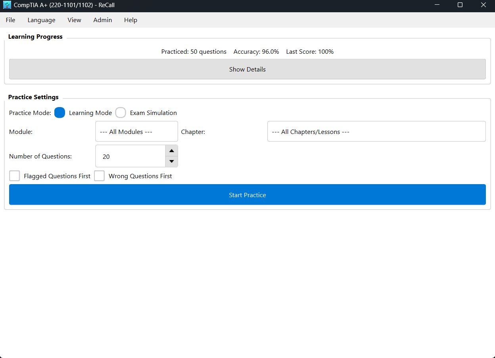
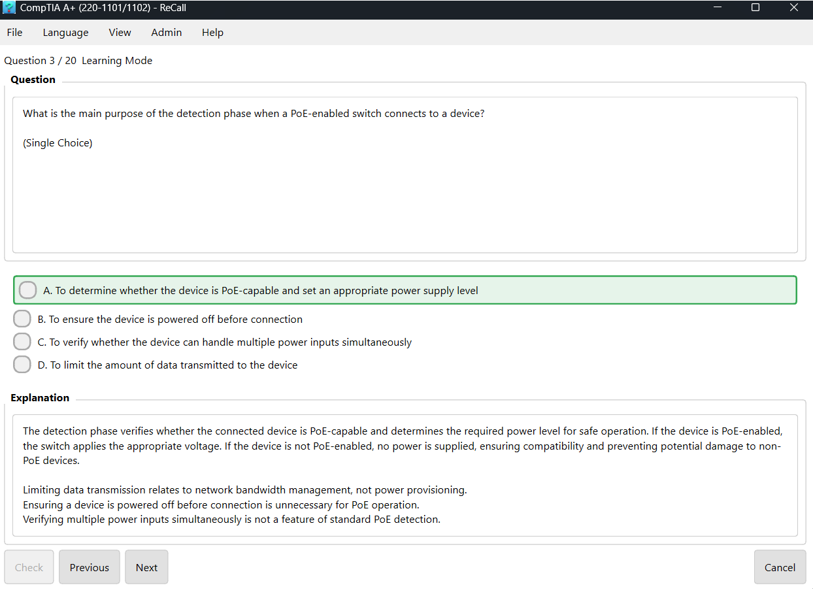

# ReCall

*Know it when it counts.*

A personal question bank for focused study and exam prep. Built with PySide6 and SQLite.

## Screenshots





## Features

- **Multi-exam support** - Create, switch, rename, and delete exam databases
- **Question management** - Add, edit, delete questions organized by modules and chapters
- **Batch import** - Import questions from Markdown files
- **Practice mode** - Learning mode (check answers immediately) and exam simulation (timed, graded)
- **Progress tracking** - Per-module accuracy, weak area detection, practice history
- **Multi-language** - English and Chinese (extensible)
- **Theming** - Light and dark themes with adjustable font size

## Download

Pre-built Windows executable is available on the [Releases](https://github.com/vincentping/recall/releases) page — no Python installation required.

## Getting Started

**Requirements:** Python 3.10+

```bash
# Install dependencies
pip install -r requirements.txt

# Compile translation files
python scripts/build_translations.py

# Run the application
python run.py
```

On first launch, the app creates an empty database. Use the **Exam Manager** to set up your exam structure (modules and chapters), then add questions via the Admin menu.

To initialize a database with a sample exam structure (CompTIA A+ 220-1101/1102):

```bash
python scripts/setup_data.py
```

## Project Structure

```
├── src/
│   ├── core/                   # Config, database, theme management
│   ├── ui/                     # Main window, home page, practice UI
│   │   └── admin/              # Exam manager, question editor, batch import
│   └── utils/                  # Markdown parser
├── resources/
│   ├── translations/           # i18n files (.ts source, .qm compiled)
│   └── themes/                 # Theme definitions (JSON)
├── config/app_config.json      # Application settings
├── data/                       # SQLite database files (user data, gitignored)
├── scripts/                    # Build and setup scripts
├── tests/                      # Unit and integration tests
├── docs/                       # Design documents
├── requirements.txt
└── run.py                      # Entry point
```

## Development

```bash
# Run tests
pip install pytest pytest-cov pytest-qt
pytest tests/

# Compile translations after editing .ts files
python scripts/build_translations.py
```

## Documentation

- [User Guide](docs/HELP.md)

## License

MIT License
